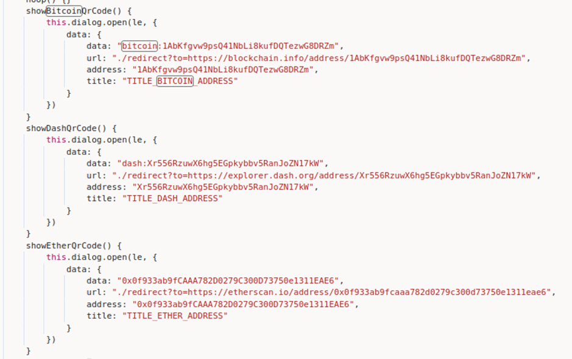

# Juice-Shop Write-up: Outdated Allowlist

## Challenge Overview

**Title:** Outdated Allowlist

**Category:** Unvalidated Redirects

**Difficulty:** ⭐ (1/6)

This challenge, named "Outdated Allowlist," involves exploiting unvalidated redirects and the use of an outdated list of allowed addresses in a web application's redirection mechanism. The task is to manipulate the URL to redirect to an unapproved or unintended cryptocurrency address by leveraging the weaknesses in the allowlist.

## Tools Used

- **Web Browser**: Used for interacting with the application and analyzing the URL redirection.
- **Developer Tools**: Essential for inspecting JavaScript code and network traffic to understand how redirects are managed.

## Methodology 

### Initial Analysis

Upon interacting with the challenge, it's observed that the web application provides QR codes for cryptocurrency transactions. The JavaScript code managing these QR codes, found within the `main.js` file, reveals that specific cryptocurrency addresses are hard-coded, and there is a redirect function that points to these addresses based on the user's selection.



```javascript
showBitcoinQrCode() {
    this.dialog.open({
        data: {
            data: "bitcoin:1AbKfgvw9psQ41NbLi8kufDQTezwG8DRZm",
            url: "./redirect?to=https://blockchain.info/address/1AbKfgvw9psQ41NbLi8kufDQTezwG8DRZm",
            address: "1AbKfgvw9psQ41NbLi8kufDQTezwG8DRZm",
            title: "TITLE_BITCOIN_ADDRESS"
        }
    })
}
```

### Steps Taken to Solve the Challenge

1. **URL Manipulation**:
   - Modified the `redirect` URL parameter to point to a new address that was on the allowlist.
   - Accessed the modified URL: `http://127.0.0.1:3000/redirect?to=https://www.blockchain.com/explorer/addresses/btc/1AbKfgvw9psQ41NbLi8kufDQTezwG8DRZm`

### Solution Explanation

The challenge was completed by exploiting the outdated allowlist. 

## Remediation

To prevent such issues in real-world applications, consider the following recommendations:

- **Regularly Update and Validate Allowlists**: Ensure that allowlists are regularly updated.
