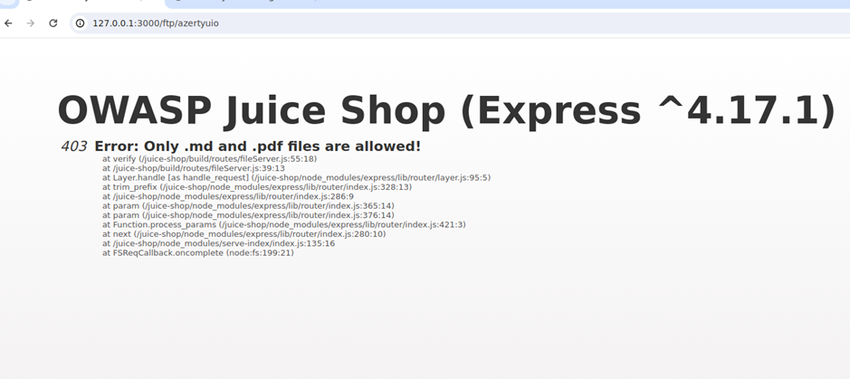

# Juice Shop Write-up: Error Handling Challenge

## Challenge Overview

**Title:** Error Handling

**Category:** Security Misconfiguration

**Difficulty:** ⭐ (1/6)

This challenge involves provoking an error that reveals backend details due to improper or non-systematic error handling. The task tests understanding of how server misconfigurations can expose sensitive information and system details that could be exploited.

## Tools Used

- Web browser
- Knowledge of common web server configurations and error handling

## Methodology and Solution

To successfully complete the challenge, I followed these steps:

1. **Experiment with URL Paths**: Accessed various non-existent or restricted URL paths on the application's server to trigger error responses.
2. **Analyze Error Messages**: Carefully examined the error messages for any signs of verbose or detailed information leakage.
3. **Provoke Specific Errors**: Tried accessing file types that might not be supported or allowed by the server configuration, based on the hint provided.

## Solution Explanation

The error was provoked by attempting to access an invalid URL on the server, which was intended to load unsupported file types or directories. The server responded with a detailed error message indicating:

- **403 Error**: The server explicitly rejected the request due to the attempted access of a restricted or unsupported file type.
- **Verbose Error Message**: The error message displayed detailed information about the server's configuration, specifically revealing that the server is running "Express JS version 4.17.1."

This information is valuable as it exposes the backend technology and its version, which could help an attacker identify specific vulnerabilities associated with this version of Express JS.

## Remediation

To prevent such information leakage, consider the following steps:

- **Implement Generic Error Messages**: Customize error pages to provide less information about the server's backend or software versions.
- **Error Handling Best Practices**: Review and apply best practices for error handling that avoid revealing details about the server's architecture, software stack, or directory structure.
- **Regular Updates and Patching**: Keep server software updated to mitigate known vulnerabilities, especially when version details might be disclosed inadvertently.
