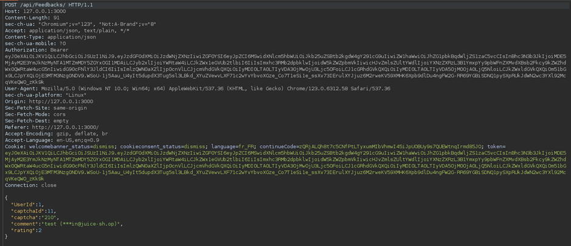

# Juice-Shop Write-up: Zero Stars Challenge

## Challenge Overview

**Title:** Zero Stars

**Category:** Improper Input Validation

**Difficulty:** ⭐ (1/6)

This challenge involves giving a zero-star feedback rating to a store, exploiting improper input validation mechanisms. The challenge tests participants' abilities to manipulate web forms and intercept network requests to alter data before submission.

## Tools Used

- Web browser with developer tools
- Burp Suite (or any other suitable network interception tool)

## Methodology and Solution

To complete the "Zero Stars" challenge, two different methods were successfully employed:

### Method 1: Intercepting and Modifying Network Requests

1. **Setup Interception**: Configured Burp Suite to intercept the HTTP requests sent from the browser using Proxy functionnality.
2. **Submit Review**: Attempted to submit a review normally through the website's interface, capturing the outgoing request in Burp Suite.
3. **Modify the Request**: Altered the `ratings` parameter in the intercepted request to `0`, despite the website originally not allowing a zero-star rating to be submitted through its user interface.

4. **Forward the Request**: Sent the modified request to the server, successfully submitting a zero-star review.

### Method 2: Manipulating the Client-Side Form

1. **Inspect Element**: Used the browser's developer tools to inspect the review submission button and found it disabled when attempting to give a zero-star rating.
2. **Enable Submission Button**: Manually removed the `disabled="true"` attribute from the HTML of the submit button using the developer tools, enabling the button.

3. **Submit the Form**: With the modified button state, submitted the form. Since the rating defaults to `null` when no stars are selected, the system processed this as a zero-star review due to lack of proper server-side validation.

## Solution Explanation

Both solutions exploit weaknesses in the application's handling of input validation:

- **Method 1** bypasses the client-side restrictions by directly manipulating the HTTP request, demonstrating the need for robust server-side validation.
- **Method 2** highlights a common oversight where client-side controls (like a disabled button) are relied upon for validation, without corresponding server-side checks.

## Remediation

To prevent such issues and secure the application against improper input validation:

- **Implement Server-Side Validation**: Ensure that all inputs, including ratings, are validated on the server side to prevent unauthorized values from being processed.
- **Secure Client-Side Logic**: Enhance client-side scripts to prevent easy tampering from the developer console. However, always assume that client-side controls can be bypassed.
- **Use Proper Data Types**: Ensure that the data type for ratings strictly accepts only valid ratings and does not default to accepting `null` or other unintended values as valid input.

