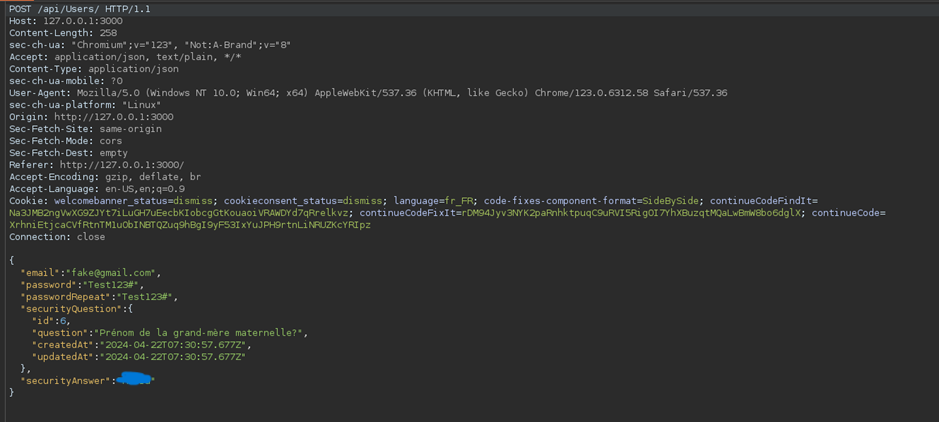
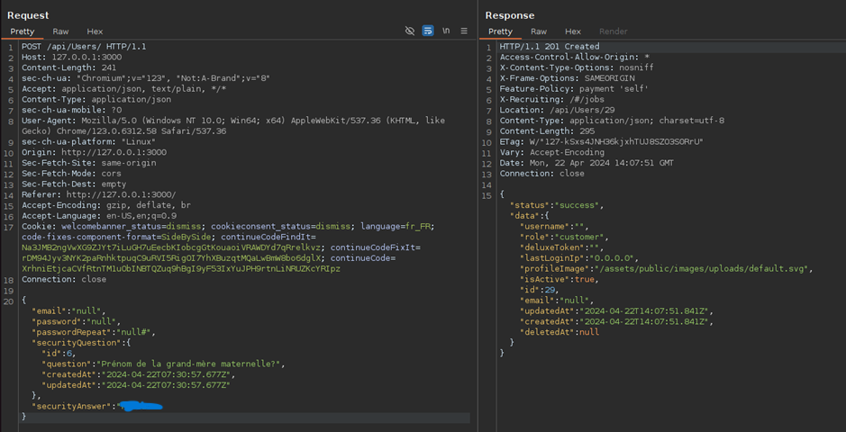

# Juice-Shop Write-up: Empty User Registration

## Challenge Overview

**Title:** Empty User Registration

**Category:** Improper Input Validation

**Difficulty:** ⭐⭐ (2/6)

The "Empty User Registration" challenge requires to exploit vulnerabilities related to improper input validation by registering a user with no email and password. This challenge tests the robustness of the application's user input validation mechanisms.

## Tools Used

- **Web Browser**: For interacting with the registration interface.
- **Burp Suite**: Used to intercept and modify HTTP requests.

## Methodology and Solution

### Challenge Setup

We are tasked with creating an account but must find a way to bypass the normal validation checks that prevent registering with empty credentials.

### Steps Taken to Solve the Challenge

1. **Intercept the Registration Request**:
   - Using Burp Suite, the registration request was intercepted during a normal registration attempt. This captured the POST request sent to `/api/Users/`.

2. **Modify the Request Payload**:
   - Initially, attempts were made to set the `email` and `password` fields to empty strings ("") or `null` values, which resulted in a "Bad Request" error or undesired normal user creation, respectively.
   - The breakthrough came when these fields were completely removed from the JSON payload. Instead of setting the fields to an empty string or `null`, the entire key-value pairs for `email` and `password` were deleted from the request.

3. **Submit the Modified Request**:
   - After removing the `email` and `password` entries entirely from the JSON payload, the modified request was forwarded. This resulted in the server processing the request without these fields, leading to the creation of a user with no email and password.

### Solution Explanation

The challenge was solved by identifying a flaw in the server's input validation process where the absence of key fields (`email` and `password`) was not adequately checked. By removing these fields entirely from the POST data, the application failed to enforce input validation rules that should have rejected such requests.

## Remediation

To prevent such vulnerabilities in real applications, the following measures should be implemented:

- **Strict Input Validation**: Ensure that all necessary fields are validated both in terms of existence and content. Requests lacking essential data should be outright rejected.
- **Mandatory Field Checks**: Backend logic should include mandatory checks to verify that all required data fields are present and non-empty before processing.
- **Use Schema Validation**: Implement schema validation for incoming data, which can automatically enforce rules about data presence, type, and format.
