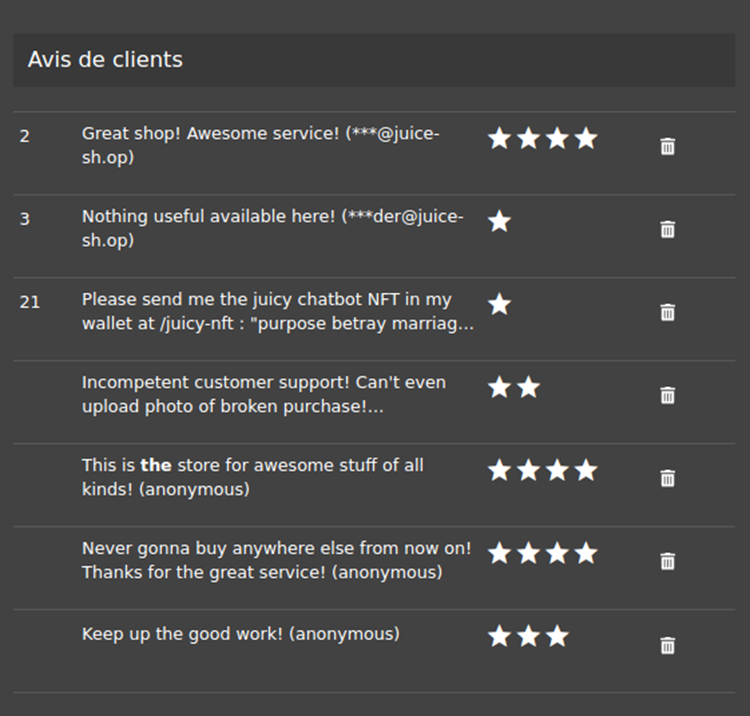

# Juice-Shop Write-up: Five-Star Feedback

## Challenge Overview

**Title:** Five-Star Feedback\
**Category:** Broken Access Control\
**Difficulty:** ⭐⭐ (2/6)

The "Five-Star Feedback" challenge requires to manipulate the review system of a web application by deleting all five-star reviews. 

## Tools Used

- **Web Browser**: To interact with the administration dashboard of the application.
- **Access to Admin Panel**: Utilizing previously obtained administrative access to navigate and modify application data.

## Methodology and Solution

### Accessing the Admin Panel

1. **Utilize Administrative Privileges**:
   - From a previous challenge, administrative access was gained, allowing the exploration of functionalities not available to regular users, including the management of user feedback.
   
2. **Locating the Feedback Management Section**:
   - Inside the admin panel, navigated to the section where user reviews and feedback are managed.

### Deleting Five-Star Reviews

3. **Identify Five-Star Reviews**:
   - Reviews are typically displayed with associated star ratings. Identified all entries with a five-star rating ready for deletion.
   

### Solution Explanation

The challenge was completed by exploiting insufficient access control measures that should restrict the deletion of feedback to authorized personnel only, and even then, should not allow mass deletions without proper oversight or rationale. 

## Remediation

To secure against such vulnerabilities in real-world applications, consider the following measures:

- **Role-Based Access Control (RBAC)**: Ensure that only authorized personnel have the ability to modify or delete user-generated content. Implement strict RBAC policies that define who can perform what actions within the admin panel.
- **Audit Trails**: Maintain an audit trail that logs all administrative actions, especially those that affect user data or feedback. This helps in accountability and in tracing how certain actions were allowed or executed.
- **Review Deletion Justifications**: Implement mechanisms that require administrators to provide justifications for deleting high volumes of content, especially positive content, which could be abused.
