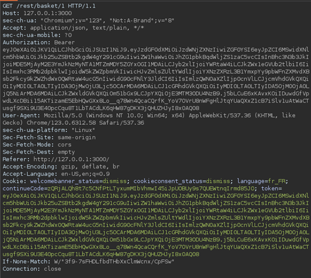
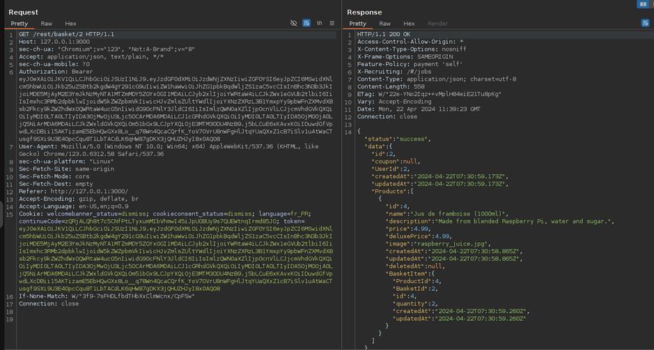
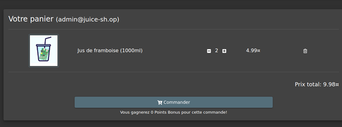

# Juice-Shop Write-up: View Basket

## Challenge Overview

**Title:** View Basket

**Category:** Broken Access Control

**Difficulty:** ⭐⭐ (2/6)

The "View Basket" challenge revolves around exploiting broken access control vulnerabilities within a web application. The specific vulnerability allows users to view the shopping basket details of other users by manipulating user-specific identifiers in web requests.

## Tools Used

- **Burp Suite**: Used for intercepting and modifying HTTP requests sent from the user's browser to the web server.

## Methodology and Solution

### Understanding the Vulnerability

The web application allows users to view the contents of their shopping basket. However, upon examining the network traffic with Burp Suite, it was discovered that the request to fetch the basket details includes a user-specific identifier (e.g., basket ID) which is vulnerable to manipulation.

### Steps Taken to Solve the Challenge

1. **Intercept the HTTP Request**:
   - Using Burp Suite, the HTTP request to retrieve the user's own basket was intercepted.
   - The request URL is: `http://127.0.0.1:3000/rest/basket/1`, where `1` is the basket ID for the current user.

   - We obtain our basket : 

2. **Modify the Basket ID**:
   - Altered the basket ID in the intercepted request from `1` to `2`, attempting to access another user's basket details.

3. **View Results**:
   - The modified request was forwarded, and the response contained the details of another user's basket, confirming the presence of broken access control.

### Solution Explanation

The challenge was successfully solved by changing the basket ID in the request URL, which should not have been possible if proper access control mechanisms were in place. This allowed access to another user's private basket information.

## Remediation

To mitigate such vulnerabilities in real applications, the following steps should be considered:

- **User Session Validation**: Ensure that each request to sensitive information like a shopping basket is validated against the user's session to confirm they are authorized to view only their data.
- **Use of Robust Access Control Mechanisms**: Implement role-based access control (RBAC) or attribute-based access control (ABAC) to enforce strict permissions on data access.
- **Regular Security Audits**: Conduct regular security audits and penetration testing to identify and fix access control issues before they can be exploited.

This challenge underscores the importance of rigorous access control mechanisms to prevent unauthorized access to sensitive user information.