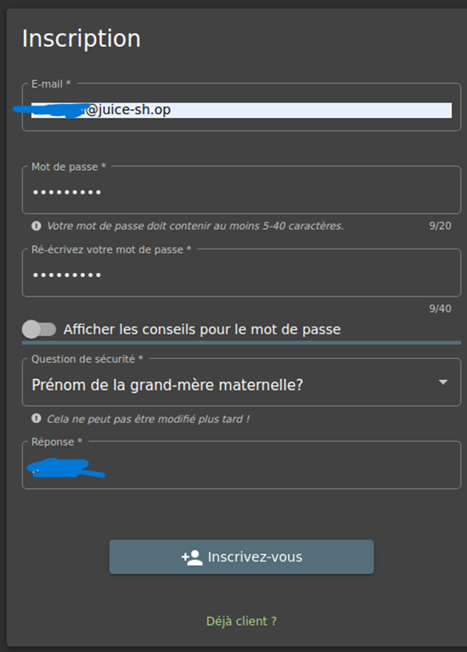
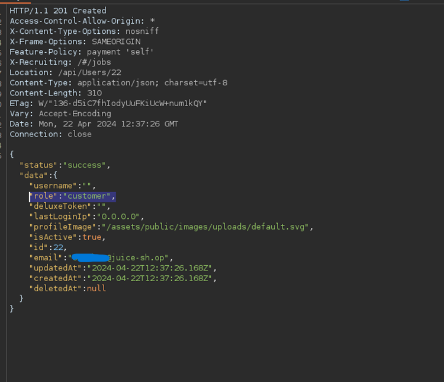
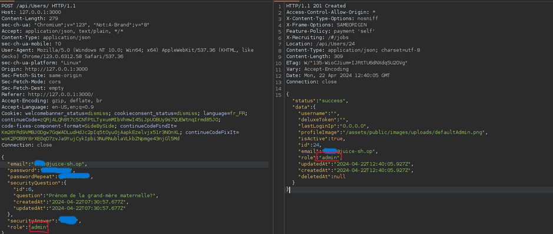

# Juice-Shop: Admin Registration

## Challenge Overview

**Title:** Admin Registration

**Category:** Improper Input Validation

**Difficulty:** ⭐⭐ (2/6)

The "Admin Registration" challenge tests ability to exploit vulnerabilities related to user registration processes, specifically focusing on input validation issues that allow elevating privileges during account creation.

## Tools Used

- **Web Browser**: To access the registration page and interact with the web application.
- **Burp Suite**: To intercept and modify HTTP requests during the registration process.

## Methodology and Solution

### Exploiting the Registration Process

1. **Registering a New User**:
   - Navigated to the registration page at `http://127.0.0.1:3000/#/register` and filled out the form to create a new user account with standard user details.

   

### Interception and Modification of Request

2. **Intercepting the Registration Request**:
   - Used Burp Suite to intercept the outgoing registration request after submitting the form. This allowed for detailed examination and modification of the HTTP request data sent to the server.

   

### Privilege Escalation

3. **Modifying User Role**:
   - Examined the captured HTTP request and noticed that the user role was defined within the payload as `"role": "customer"`.

   

   - Modified the role parameter from `"customer"` to `"admin"` directly in the HTTP request, altering the intended behavior of the registration process.
   
   

4. **Submitting the Modified Request**:
   - Sent the modified request through Burp Suite, effectively trying to bypass the normal user role assignment logic.

### Verification of Admin Access

5. **Checking the Registration Outcome**:
   - The response from the server confirmed that the account was successfully created with the role of an administrator.
   - Verified by logging into the application with the new credentials and accessed admin-specific functionalities to ensure that the role was correctly assigned.

### Solution Explanation

The challenge was successfully completed by identifying and exploiting an improper input validation flaw within the registration process. By modifying the user role in the registration request, it was possible to bypass the application's normal security measures and grant administrative privileges to a newly created account.

## Remediation

To prevent such vulnerabilities in real-world applications:

- **Strict Backend Validation**: Ensure that all user input, especially relating to user roles and privileges, is rigorously validated on the server side to prevent unauthorized modifications.
- **Role Management**: Assign roles based on secure server-side logic rather than relying on client-side input.
- **Use of Role-Based Access Control (RBAC)**: Implement robust RBAC mechanisms that properly segregate user privileges and prevent unauthorized elevation.
