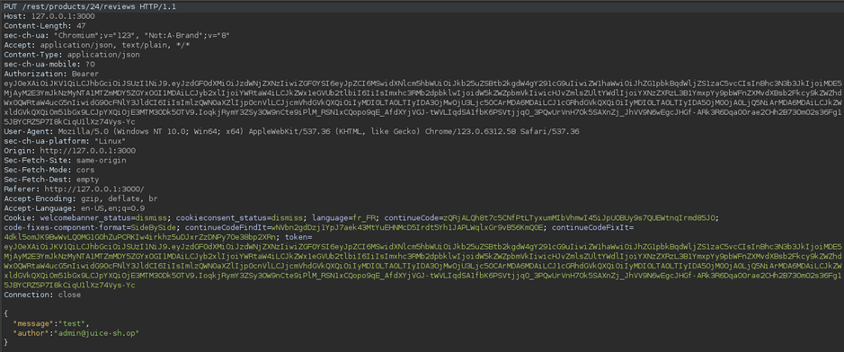
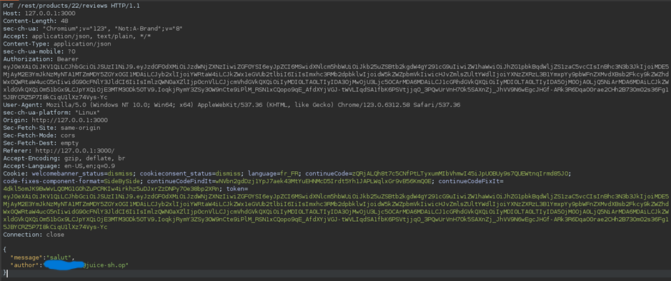
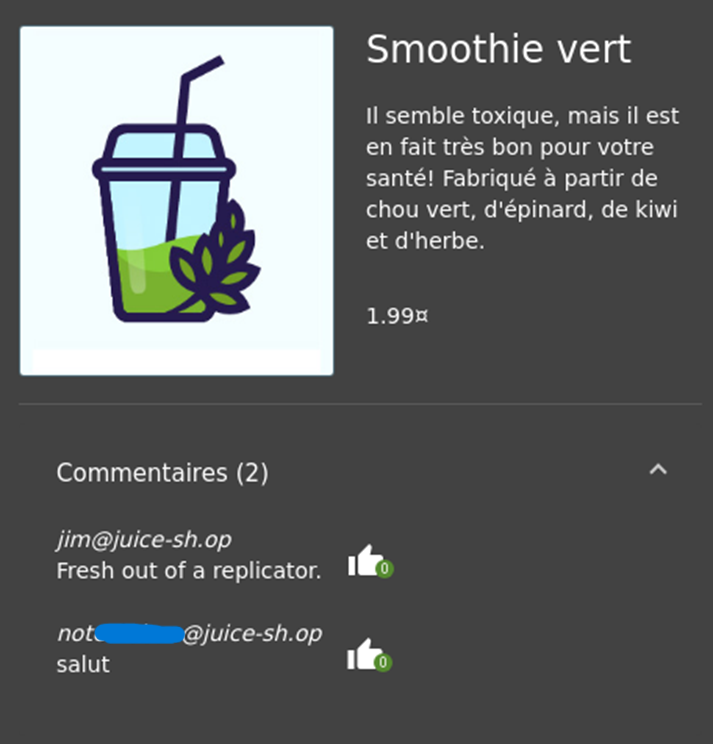
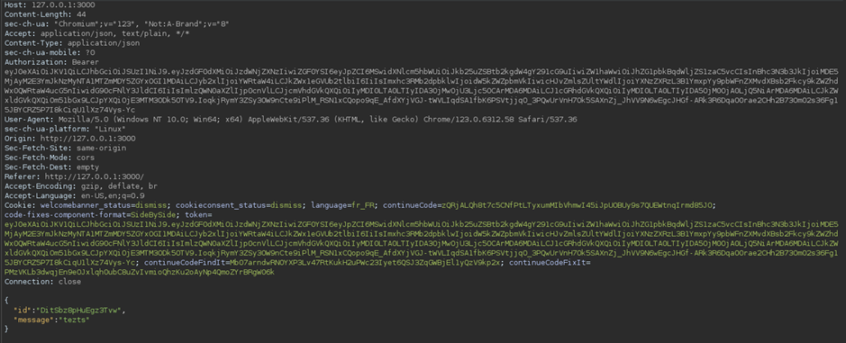
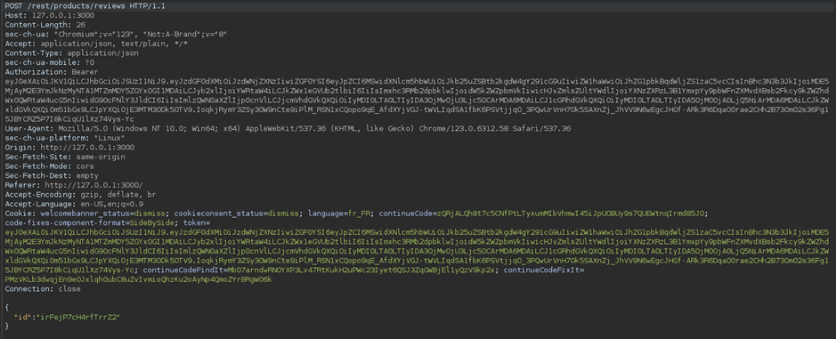
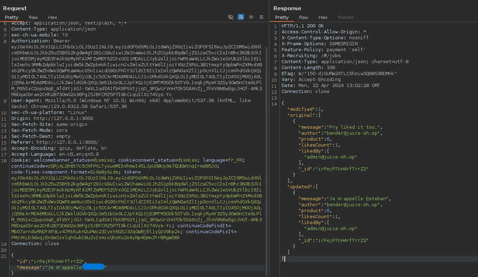

# Juice-Shop Write-up: Forged Review Challenge

## Challenge Overview

**Title:** Forged Review

**Category:** Broken Access Control

**Difficulty:** ⭐⭐⭐ (3/6)

This challenge involves manipulating the review submission process in a web application to post reviews as another user, exploiting weak access control mechanisms.

## Tools Used

- Burp Suite (for intercepting and manipulating HTTP requests)

## Methodology and Solution

### Identifying the Vulnerability

1. **Submit a Review**: Started by submitting a generic review through the web application's interface.
2. **Intercept the Request**: Used Burp Suite to intercept the outgoing HTTP request made when submitting the review.

3. **Analyze Request Parameters**: Noted that the request payload includes an "author" parameter, which appears to manually set the author of the review, suggesting that the server does not validate whether the user submitting the review is the actual author indicated in the request.

### Exploiting the Vulnerability

1. **Modify the Author Parameter**: Changed the "author" parameter in the HTTP request to another user's name or identifier.

2. **Resend the Request**: Sent the modified request back to the server using Burp Suite.
3. **Verify Review Submission**: Checked the application to see if the review was posted under the name of the altered "author", confirming the vulnerability.

### Additional Manipulation

- **Edit Existing Reviews**: Discovered that reviews could also be edited by intercepting and manipulating edit requests in a similar fashion.

- **Identify Review IDs**: Found that review IDs could be collected from other functionalities like the "like" feature, where intercepting the request reveals the ID of reviewed messages.

- **Manipulate Review by ID**: Used the obtained IDs to edit reviews by other users, injecting the ID into the edit request to change content of reviews not originally authored by the attacker.

- **Result**: 

## Solution Explanation

The challenge highlighted significant security flaws related to input validation and session management:
- **Lack of Server-Side Validation**: The server failed to validate if the logged-in user matched the "author" of the review.
- **Insecure Direct Object References (IDOR)**: The application did not properly secure review IDs, allowing an attacker to modify any review by simply knowing its ID.

## Remediation

To secure the application against such vulnerabilities, implement the following measures:
- **Strict Server-Side Validation**: Ensure that the server validates that the user making the request is the owner of the account or content being modified. This can involve checking session tokens against user IDs.
- **Use Secure Session Handling**: Implement robust session management that securely associates users with their actions and prevents parameter manipulation.
- **Role-Based Access Control**: Enforce access controls that verify a user's role and permissions before allowing modifications to data.

