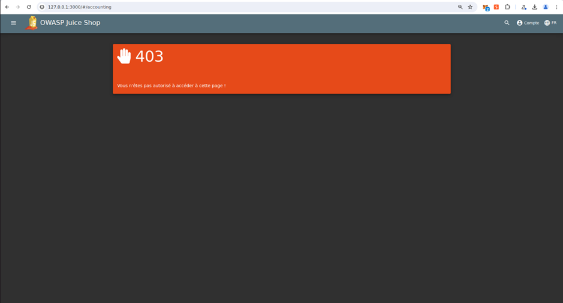
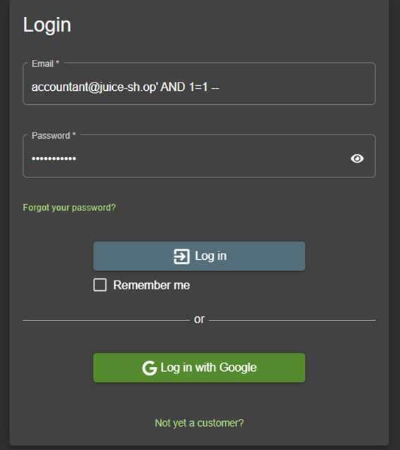
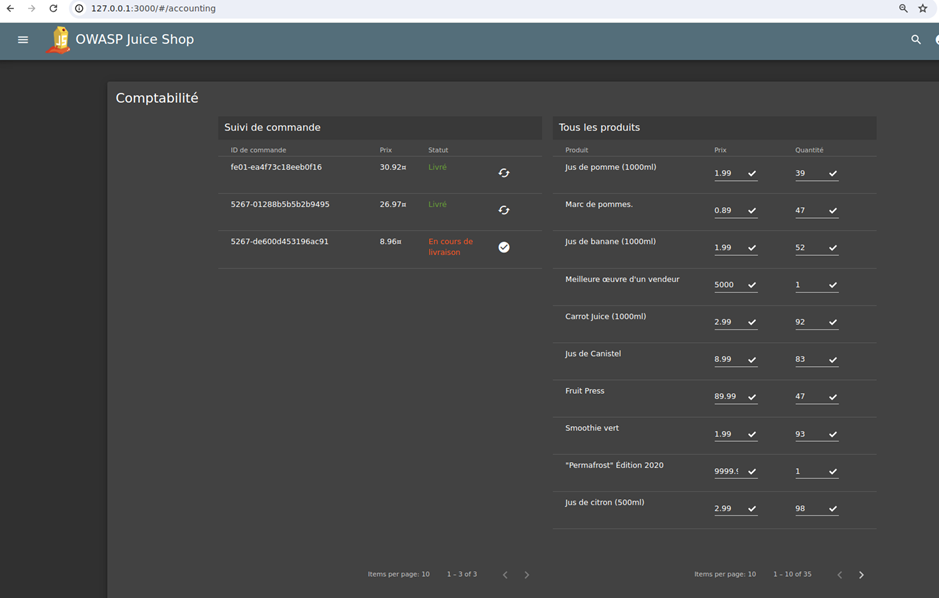
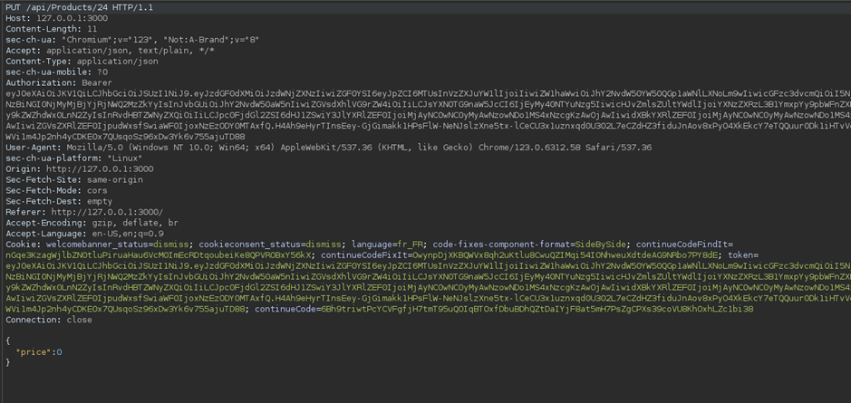
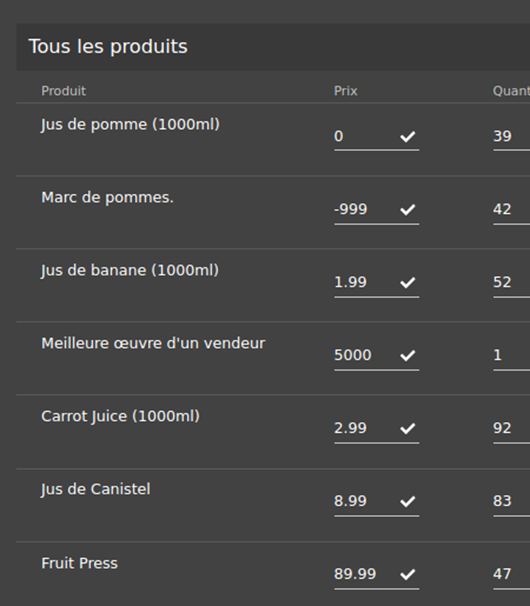

# Juice-Shop Write-up: Payback Time Challenge

## Challenge Overview

**Title:** Payback Time

**Category:** Business Logic Errors

**Difficulty:** ⭐⭐⭐ (3/6)

This challenge involves exploiting a business logic flaw to achieve unauthorized financial gain through manipulating product pricing in an e-commerce application.

## Tools Used

- Web browser
- Burp Suite or Developper Tool for requests 

## Methodology and Solution

### Initial Steps and Discovery

1. **Inspect Application Code**: Started by examining the `main.js` file, which often contains paths and client-side logic. Discovered a path `/accounting` which seemed promising for administrative actions.

2. **Attempt to Access Accounting Page**: Accessed `http://127.0.0.1:3000/#/accounting` directly in the browser, leading to an authorization error page.

3. **Identify Account with Necessary Permissions**:
   - Found the email of a user likely to have necessary permissions (`accountant@juice-sh.op`) from product comments.

   

   - Used an SQL injection vulnerability previously identified to gain access to this account. The correct syntax involved using `AND` instead of `OR` in the SQL injection to specifically target the accountant's account.

   

### Exploiting the Business Logic

1. **Access Accounting Page as the Accountant**:
   - Logged in as the accountant, re-accessed the accounting page which now displayed product pricing and allowed modifications.

   

2. **Attempt to Modify Product Prices**:
   - Tried to set a negative price directly through the user interface, which the system corrected to zero.
   - Intercepted the price update request using Burp Proxy.

   

3. **Manipulate Product Pricing**:
   - Modified the intercepted request, setting the price parameter to a negative value.
   - The server accepted this modified request, updating the product price to the negative value.

     

4. **Exploit Negative Pricing**:
   - Purchased the product with the negative price.
   - As the system processed the negative amount, it resulted in a credit to the account rather than a charge, effectively leading to a payout.

   

## Solution Explanation

This challenge exploited a series of vulnerabilities and misconfigurations:
- **Authorization Flaw**: Improper access controls allowed for unauthorized access via SQL injection.
- **Business Logic Error**: The system failed to adequately handle improper inputs for product pricing, allowing for negative values to be submitted through backend manipulation.

## Remediation

To prevent such vulnerabilities in real applications:
- **Proper Input Validation**: Ensure that all inputs, especially those related to financial transactions, are validated both client-side and server-side to prevent manipulation.
- **Use Prepared Statements for SQL**: Avoid SQL injection by using prepared statements with parameterized queries.
