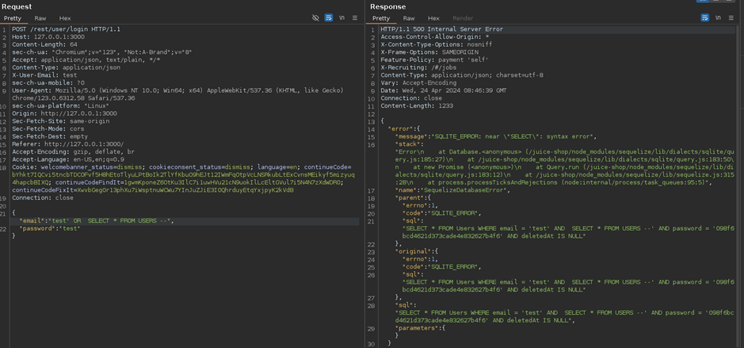
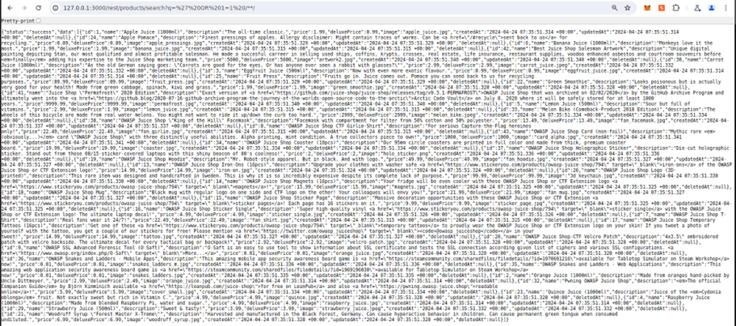
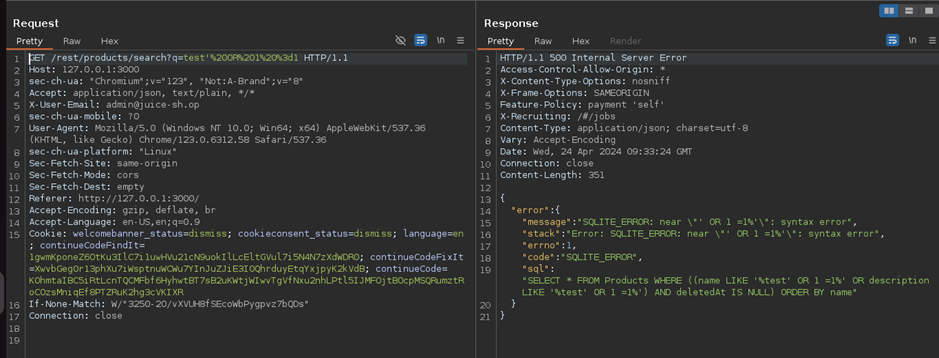
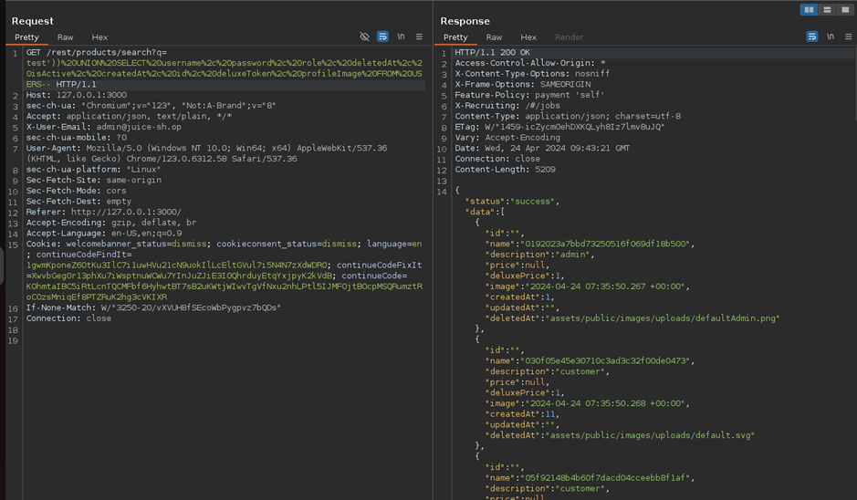

# Juice-Shop Write-up: Users Credentials

## Challenge Overview

**Title:** Users Credentials  
**Category:** Injection  
**Difficulty:** ⭐⭐⭐⭐ (4/6)

This challenge was about exploiting an SQL Injection vulnerability to extract sensitive user credentials from the application's database.

## Tools Used

- **Web Browser**: Used to interact with the application and manipulate URL parameters.
- **Developer Tools**: Employed to inspect network traffic and modify HTTP requests.

## Methodology and Solution

### Step 1: Identifying the Injection Point

1. **Exploration**:
   - Initially, I tried various inputs such as the login form were tested for SQL Injection vulnerabilities but did not yield results.

   

   - Attention was redirected towards the endpoint of product search feature which appeared to interact directly with the database. I find this endpoint in requests :

   

### Step 2: Testing for SQL Injection

2. **Exploiting the Search Feature**:
   - Basic search produce a JSON result which mean that we can interact with this API client side :
   
   

   - An attempt to perform a basic SQL injection was made using the search functionality by appending `' OR 1=1 /**/` to the search term, which successfully bypassed the initial search logic.

   

### Step 3: Crafting the Injection Query

3. **Determining Table Structure**:
   - Initially, a basic union query was attempted to retrieve data from the `USERS` table: `test' UNION SELECT * FROM USERS /**/`. This resulted in an error indicating a mismatch in the number of columns.

   
   

   - Through further experimentation, the correct number of columns was determined, and the query was refined to: `test')) UNION SELECT username, password, role, deletedAt, isActive, createdAt, id, deluxeToken, profileImage FROM USERS--`.

### Step 4: Final Payload and Data Retrieval

4. **Successful Data Extraction**:
   - Adjusting the query to match the column structure of the `Products` table allowed for the successful extraction of user credentials.

   

   - To trigger the challenge flag, it was necessary to include the `email` field in the injection query, resulting in the final payload: `test')) UNION SELECT username, password, role, deletedAt, isActive, createdAt, id, email, profileImage FROM USERS--`.

   

## Solution Explanation

The challenge was overcome by exploiting an SQL Injection vulnerability within the product search API endpoint. This vulnerability was used to extract user credentials, including usernames, passwords, and email addresses, directly from the database.

The solution involved several key steps:
- Identifying a vulnerable endpoint.
- Testing and confirming the SQL Injection vulnerability.
- Crafting a query that matched the expected structure of the original query to avoid errors.
- Ensuring all necessary user fields were included in the output to meet the challenge criteria.

### Security Measures

To prevent such vulnerabilities:
- **Input Sanitization**: Ensure all inputs are sanitized to prevent injection of malicious SQL code.
- **Use of Prepared Statements**: Utilize prepared statements with parameterized queries to prevent SQL injection.
- **Least Privilege**: Limit database permissions for applications to only those necessary for their function.
