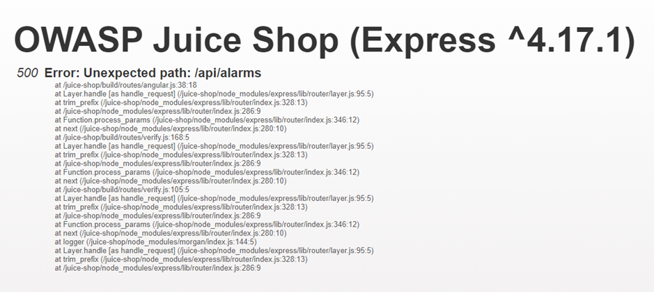

# Juice-Shop Write-up: Access Log

## Challenge Overview

**Title:** Access Log  
**Category:** Sensitive Data Exposure  
**Difficulty:** ⭐⭐⭐⭐ (4/6)

This challenge tasked us with gaining access to any of the server's access log files.

## Tools Used

- **Browser**: Used to navigate the Juice-Shop application and attempt various URLs to find the logs.
- **Text Editor**: For analyzing URLs and formulating strategies to access hidden files.

## Methodology and Solution

### Step 1: Initial Exploration

1. **Initial Attempts**:
   - Began by trying to locate the log files through commonly known SIEM endpoints and directory traversal methods. Initial efforts included trying to access well-known SIEM tool endpoints (such as Splunk's standard paths) directly through the browser but were met with HTTP errors or blank pages.

   

### Step 2: Understanding Application Structure

2. **Exploration Through Application**:
   - Investigated various parts of the application to understand its structure better and hypothesized that sensitive data like access logs might be exposed through less secure or overlooked parts of the application.

### Step 3: Gaining Elevated Access

3. **Utilizing Elevated Access**:
   - After gaining access to a support user account through a previous 6-stars level challenge (Login Support), re-evaluated available options for access paths that might be relevant to a support user.

### Step 4: Finding the Log Access Path

4. **Discovery of Log Access**:
   - Accessed the URL `127.0.0.1:3000/support/logs` directly from the browser, which was a new path deduced based on the role and possible needs of a support user within the application. This method of guessing the url was highly encourage by hints of the challenge.

### Step 5: Accessing and Downloading Logs

5. **Downloading Logs**:
   - Found and downloaded the logs listed on the `/support/logs` page. This confirmed that the correct log files were exposed and accessible, validating the challenge.

   

## Solution Explanation

The specific URL to the logs was not directly linked or indicated from the main user interface and required speculative access based on our new role capabilities.

### Security Recommendations

- **Restrict Sensitive Directory Access**: Ensure that directories containing sensitive information like logs are not accessible via simple URL changes or without appropriate authentication and authorization checks.
- **Role-Based Access Controls**: Implement robust access control mechanisms that restrict access to sensitive functionalities based on user roles.
