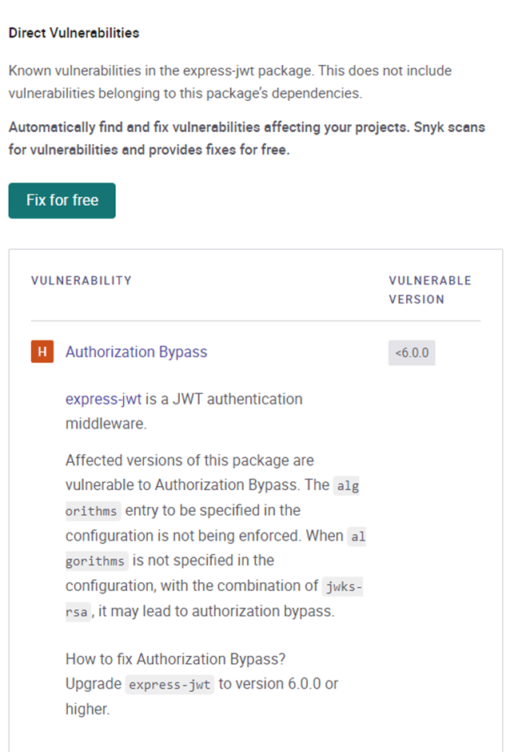

# Juice-Shop Write-up: Vulnerable Library

## Challenge Overview

**Title:** Vulnerable Library\
**Category:** Vulnerable Components  
**Difficulty:** ⭐⭐⭐⭐ (4/6)

This challenge requires identifying a vulnerable library used in the Juice Shop application, highlighting the importance of maintaining updated dependencies to prevent security vulnerabilities.

## Tools Used

- **Developer's backup file (`package.json.bak`)**: To review the dependencies used by Juice Shop.
- **Online Vulnerability Databases (Snyk, NPM advisories)**: To check for known vulnerabilities in the listed libraries.

## Methodology and Solution

### Step 1: Analyzing the Developer's Backup

Starting with the developer's backup file, I reviewed all dependencies. Each library version was compared against known vulnerabilities documented in various security databases like Snyk and NPM advisories.

### Step 2: Identifying the Vulnerable Library

The `express-jwt` library, used for JWT authentication, was found to have significant vulnerabilities:

- **Library:** express-jwt
- **Version:** < 6.0.0
- **Vulnerability:** Authorization Bypass
- **Details:** The configuration was not enforcing the `alg` algorithms entry, allowing bypass if `algorithms` was not explicitly set in conjunction with `jwks-rsa`.

### Step 3: Reporting the Vulnerability

After identifying the vulnerability, it was necessary to report it to the simulated shop's management through their platform, mimicking responsible disclosure practices.

## Solution Explanation

The express-jwt library below version 6.0.0 was vulnerable due to its handling of JWT configurations, particularly the lack of enforced algorithm checking. This could lead to authorization bypass if the attacker exploited the JWT algorithm header. Updating the library to version 6.0.0 or above would remediate the vulnerability, as these versions include patches that enforce stricter handling of JWT settings.

Note : This vulnerability will be exploited in JWT challenges later ! 

## Remediation

- **Regular Dependency Audits:** Regularly scan and audit software dependencies for known vulnerabilities and apply updates or patches promptly.
- **Automated Security Tools:** Implement automated security tools like Snyk in the development pipeline to detect vulnerabilities early.
- **Security Awareness:** Ensure that developers are aware of the risks associated with using outdated or vulnerable libraries and encourage secure coding practices.

This challenge underscores the critical need to maintain an up-to-date library inventory to safeguard applications from known security threats.