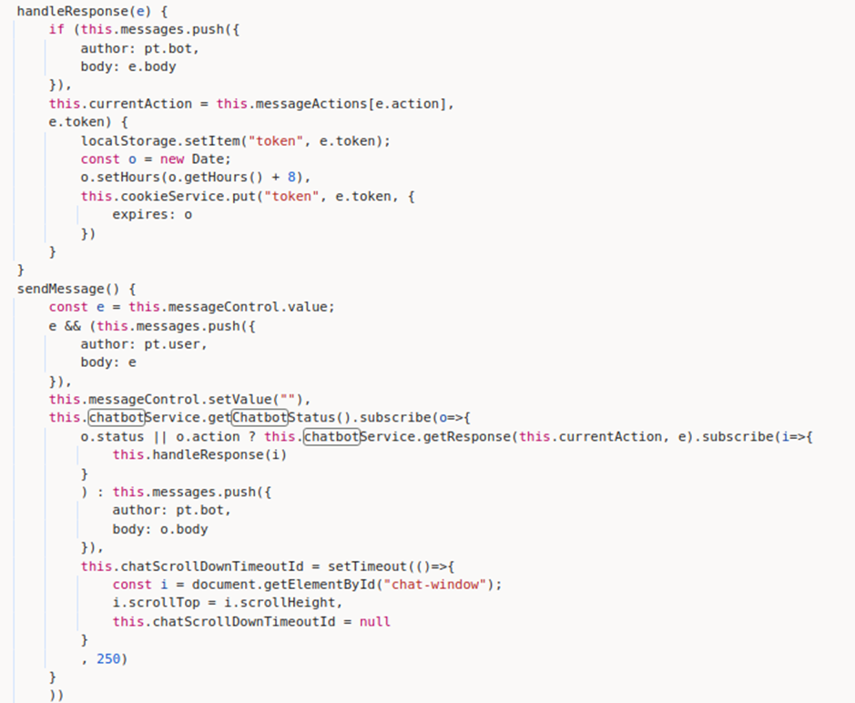

# Juice-Shop Write-up: Kill Chatbot

## Challenge Overview

**Title:** Kill Chatbot  
**Category:** Application Logic  
**Difficulty:** ⭐⭐⭐⭐⭐ (5/6)

This challenge involves disabling the chatbot feature on the Juice Shop platform without directly attacking the server or service, but rather through manipulating the chatbot's behavior via application vulnerabilities.

## Tools Used

- **Web Browser:** For interacting with the chatbot and inspecting web elements.
- **Developer Tools:** To analyze the client-side code and network requests.

## Methodology and Solution

### Step 1: Understanding the Chatbot Implementation

Upon initial analysis of the web page and its functionalities, the chatbot, identified as "juicy-chat-bot," seemed to operate based on a script loaded from an external source. Observations and code reviews suggested that the bot's operation might be controlled by conditions or flags that could potentially be manipulated.


### Step 2: Code Analysis

The JavaScript code managing the chatbot included functions that controlled its online status and response mechanisms. It appeared to manage sessions and user interactions using tokens and possibly evaluated conditions for active responses.



### Step 3: Investigating External Dependencies

The investigation led to the discovery of the bot's GitHub repository (https://github.com/juice-shop/juicy-chat-bot), which provided crucial insights into its dependencies and operational logic. 


### Step 4: Exploiting Script Evaluation

Key discovery was that the chatbot used `vm2`'s `VM` module for executing dynamic scripts. This module, while designed to provide sandboxed execution of JavaScript code, could be prone to certain types of injection if not properly handled.

```javascript
const { VM } = require('vm2');
this.factory.run = function(script) {
    let vm = new VM();
    vm.run(script);
};
```

### Step 5: Code Injection

The chatbot prompted users for their name, which was then processed by the `factory.run()` method, executing a script that included the user-provided name. This interaction provided an opportunity for injection if user input was incorporated into the script unsanitized. We can guess that this function may work like an "exec" call in JS, meaning that we can try all related exploit.

### Successful Payload Execution

By manipulating the input for the bot's name prompt, an injection was crafted to disrupt the process handling the chatbot:

```plaintext
testname"); process=null; users.addUser("1234", "malicioususer")
```

We put this payload into :
```plaintext
this.factory.run(‘users.addUser(“${token}”, “${name}”)’)
```

Which finally give us :
```plaintext
this.factory.run(‘users.addUser(“blabla”, “testname”); process=null; users.addUser(“1234”, "malicioususer")’)
```


This payload aimed to unset critical process variables or alter the flow within the sandbox environment, effectively "killing" the chatbot by stopping its execution or corrupting its state.

### Solution Explanation

The successful disruption of the chatbot was achieved by exploiting the script execution vulnerability within the chatbot's script handling logic. By injecting a code segment that corrupted the process state, the chatbot ceased to respond, fulfilling the challenge's requirements. This type of vulnerability highlights the risks associated with executing dynamically constructed scripts with unsanitized input.

### Security Recommendations

- **Sanitize Inputs:** Always sanitize user inputs before including them in dynamically executed scripts or database queries.
- **Secure Script Execution:** Utilize secure coding practices when implementing features like dynamic script execution. Libraries like `vm2` must be configured correctly to prevent escapes from the sandbox environment.
