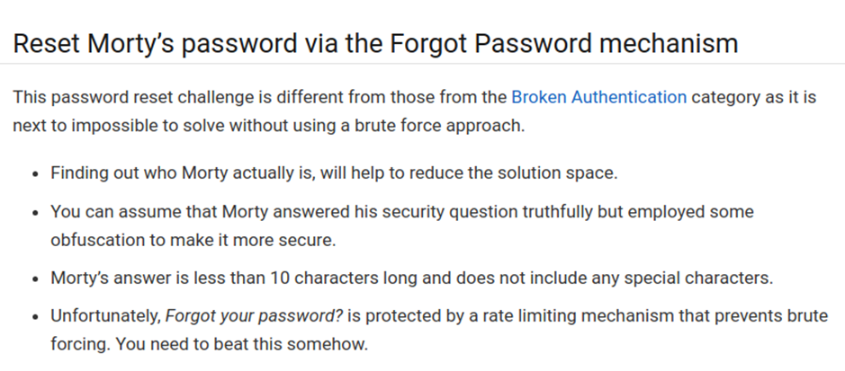

# Juice-Shop Write-up: Reset Morty's Password

## Challenge Overview

**Title:** Reset Morty's Password\
**Category:** Security Misconfiguration\
**Difficulty:** ⭐⭐⭐⭐⭐ (5/6)

This challenge involves resetting the password for Morty's account (morty@juice-sh.op) by answering his security question: "What is the name of your favorite pet?" 

## Tools Used

- **Custom Leet Speak Script**: For generating all possible leet variations of the names "Snuffles" and "SnowFall". [Script available here](https://gist.github.com/philly-vanilly/70cd34a7686e4bb75b08d3caa1f6a820).
- **HTTP Request Manipulation Tool**: For automating requests and modifying HTTP headers to bypass security measures.

## Methodology and Solution

### Preparation and Initial Analysis

1. **Understanding the Challenge**:
   - The hints are the followings : 
   
   

   - Analyze the provided hints and fan page details to confirm the probable answers to the security question.
   
    

   - Based on provided hints, the potential answers are "Snuffles" or "SnowFall". The task is complicated by the requirement to use an obfuscated password that must be fewer than 10 characters, without special characters, and a necessity to bypass the anti-brute-force mechanism by manipulating the `X-Forwarded-For` header.

### Wordlist Generation

2. **Generate Leet Speak Variations**:
   - Use the custom script to create a wordlist of potential passwords based on "Snuffles" and "SnowFall", incorporating leet speak substitutions.

### Brute Force Attack Setup

3. **Configure Brute Force Tool**:
   - Start the tool to iterate over the generated wordlist. Each password attempt includes a modified `X-Forwarded-For` header to prevent detection by the brute force mechanism.

### Solution Confirmation

4. **Verification**:
   - Upon successful reset, log into the account using the new password to ensure access is granted.

### Solution Explanation

The successful password reset was achieved by a combination of leet speak wordlist generation and circumventing IP-based security measures through header manipulation. This approach highlights potential vulnerabilities in the application's password reset functionality and its susceptibility to both brute force attacks and header spoofing.

## Remediation

To improve security against similar attacks, the application should:

- **Enhance Brute Force Detection**: Implement more sophisticated detection mechanisms that consider a wider range of headers and behavioral patterns.
- **Secure Account Recovery Processes**: Add additional layers of verification to the password recovery process to prevent unauthorized access.
- **Remove Security QUestions**: Using security questions is not considered as secure, you rather may rely on an email sended to user that want to reset their password.